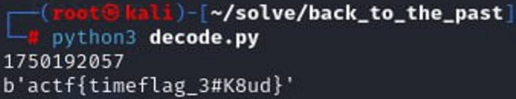

<p align="center">
  
</p>

# 🧩 Назад у минуле (Back to the Past)
## **Категорія:** Cryptography  
## **Складність:** Medium

---
### **Опис завдання:**  
Під час розслідування несанкціонованого доступу до внутрішніх даних університету була знайдена частина коду для шифрування важливої інформації.  
Автор залишився невідомим, але відомо, що він неодноразово з'являвся в системі у період з ```10.06.2025T00:00:00Z``` по ```18.06.2025T23:59:59Z``` за UTC.  
Також він залишив файл, який точно містить щось цікаве.

---
### **Файли**
```flag.enc```  
```script.py```
### **Розв'язання:**  
1. Після відкриття коду стає зрозуміло, що використовується XOR шифрування, байти для XOR’у генерується рандомно з використанням seed-значення, яке є теперішнім timestamp за UTC.
  ```python
#script.py
  import random
from datetime import datetime, timezone

FLAG = b'actf{example_flag}'
SEED = int(datetime.now(timezone.utc).timestamp())
random.seed(SEED)

key = bytes([random.randint(0, 255) for _ in range(len(FLAG))])
encrypted_flag = bytes([a ^ b for a, b in zip(FLAG, key)])

with open('flag.enc', 'wb') as f:
    f.write(encrypted_flag)
```  
  
2. Оскільки ми знаємо період часу, коли автор був у системі, ми можемо перебрати усі можливі timestamp’и та спробувати відновити ключ шифрування і флаг.
   Мій варіант рішення:
```python
  import random
  from datetime import datetime, timezone, timedelta

  first_day = int(datetime(2025, 6, 10, 0, 0, 0, tzinfo=timezone(timedelta(hours=3))).timestamp())
  last_day = int(datetime(2025, 6, 18, 23, 59, 59, tzinfo=timezone(timedelta(hours=3))).timestamp())

  with open('flag.enc', 'rb') as f:
    enc_flag = f.read()
    for seed in range(first_day, last_day):
        random.seed(seed)
        key = bytes([random.randint(0, 255) for _ in range(len(enc_flag))])
        flag = bytes([a ^ b for a, b in zip(enc_flag, key)])
        if 'actf{' in flag.decode(errors='ignore'):
            print(seed)
            print(flag)
            exit()
```

  Після запуску скрипта, через деякий час отримаємо флаг та seed:
  <p align="center">
    
  </p>
  
---
#### **Flag:** ```actf{timeflag_3#K8ud}```  
