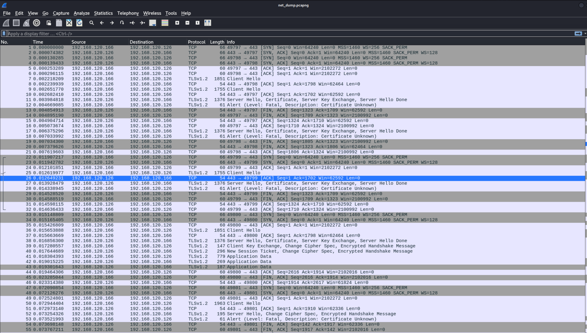
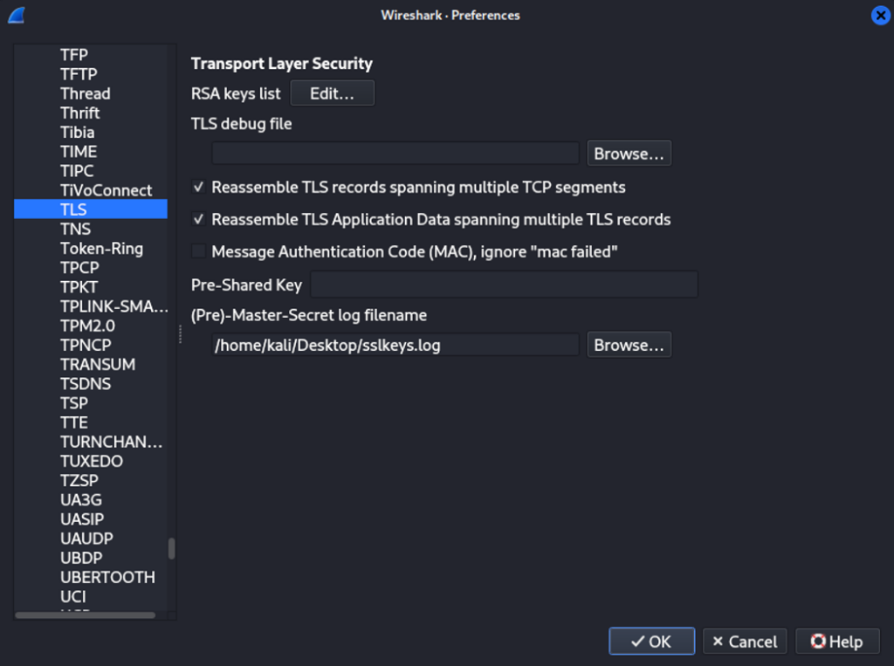
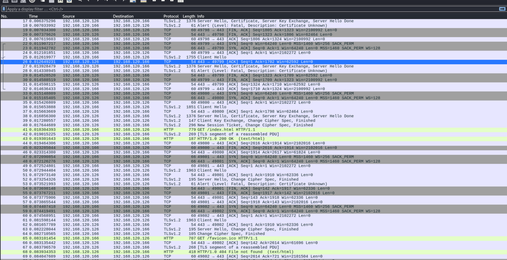
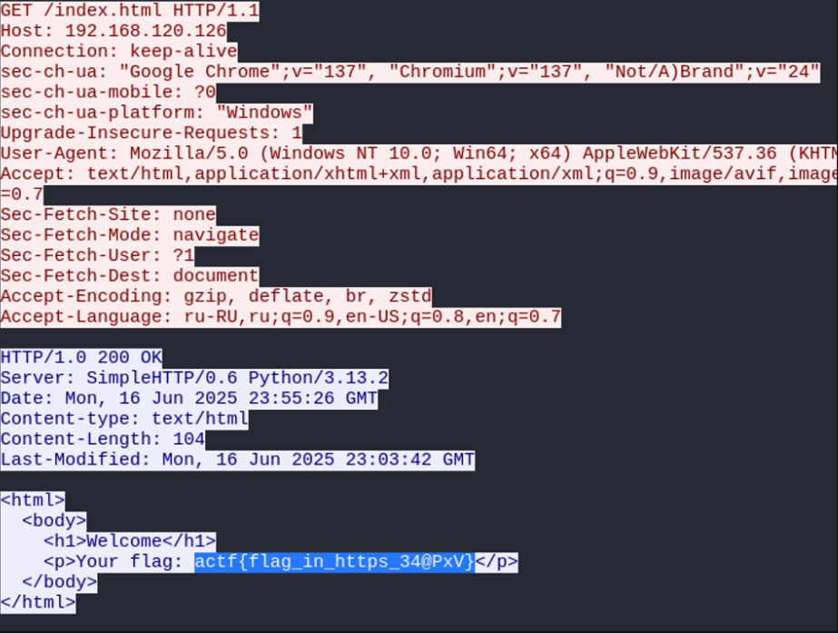

<p align="center">
  
</p>

# 🧩 Ключ під килимком (Key Under the Doormat)
## **Категорія:** Cryptography  
## **Складність:** Easy

---

### **Опис завдання:**  
Під час внутрішнього аудиту було виявлено підозрілу активність на комп’ютері одного з викладачів.  
З’ясувалося, що на його пристрої діяв зловмисний процес, який перехопив файл sslkeys.log. Саме під час цієї атаки був зафіксований фрагмент трафіку між викладачем і одним із серверів університету.  
Подейкують, що у перехопленній комунікації приховано дещо важливе.

---
### **Файли**
```net_dump.pcapng```
```sslkeys.log```

### **Розв'язання:**
1. Після завантаження відкриваємо дамп трафіку та бачимо, що маємо зашифровані потоки.  
  <p align="center">
    
  </p>  
  
2. Оберемо пункт **Edit → Preferences → Protocols → TLS** та в полі **(PRE)-Master-Secret log filename** вкажемо наш `sslkeys.log`.
  <p align="center">
    
  </p>

3. Натиснемо **OK** - отримаємо розшифрований трафік
   <p align="center">
     
  </p>

4. Оберемо **GET-запит до index.html** та натиснемо **Follow HTTP stream**.
  <p align="center">
    
  </p>

---
#### **Flag:** ```actf{cryptography_flag}```  
