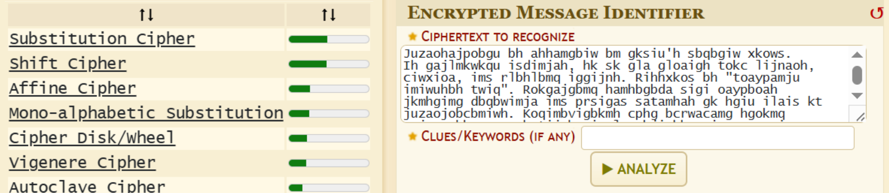
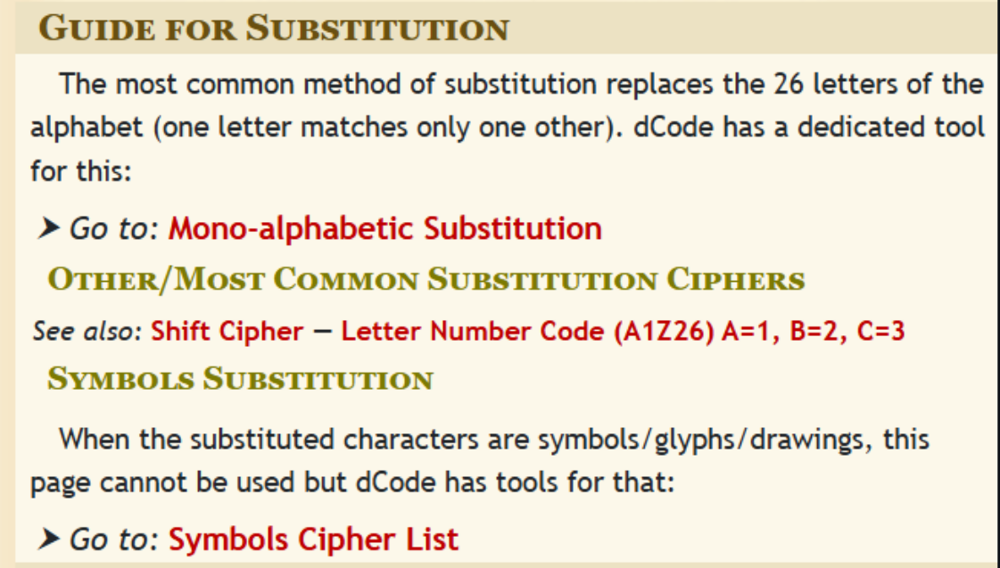

<p align="center">
  
</p>

# 🧩 Зашифрований конспект (The Encrypted Notes)
## **Категорія:** Cryptography  
## **Складність:** Easy

---

### **Опис завдання:**  
Під час підготовки до сесії викладач зашифрував свій унікальний конспект, щоб ніхто не міг ним скористатися без дозволу. На останній лекції він оголосив: хто дійде до пароля, захованого в конспекті, і назве його під час іспиту - отримає автомат.  
Q: Розшифруйте файл і знайдіть пароль, який захований всередині тексту. Відповідь подайте у форматі actf{password}, пробіли замінити знаком “_”. 

---
### **Файли**
```notes.txt```
### **Розв'язання:**  
```notes.txt```
```
Juzaohajpobgu bh ahhamgbiw bm gksiu'h sbqbgiw xkows.  
Ih gajlmkwkqu isdimjah, hk sk gla gloaigh tokc lijnaoh, ciwxioa, ims rlbhlbmq iggijnh. Rihhxkos bh "toaypamju imiwuhbh twiq". Rokgajgbmq hamhbgbda sigi oaypboah jkmhgimg dbqbwimja ims prsigas satamhah gk hgiu ilais kt juzaojobcbmiwh. Koqimbvigbkmh cphg bcrwacamg hgokmq amjourgbkm, cpwgb-tijgko ipglamgbjigbkm, ims oaqpwio hajpobgu ipsbgh gk hgiu ilais kt juzaojobcbmiwh. Aspjigbmq phaoh izkpg hita kmwbma roijgbjah bh iwhk jopjbiw gk oaspja gla obhn kt zoaijlah. Bm gla adkwdbmq wimshjira kt juzaohajpobgu, rokijgbda caihpoah ioa gla nau gk hitaqpiosbmq bmtkocigbkm ims cibmgibmbmq gophg.
```
1. Скористаємося веб-сервісом [dcode](https://www.dcode.fr/cipher-identifier) для вирішення задачі. Визначимо тип шифру.  
    <p align="center">
      
    </p>  
   
    Наймовірніший результат - шифр підстановки, перейдемо до нього.  
   
    <p align="center">
        
    </p>  
   
    Тут нам пояснюють, що це за вид шифру, та надають інструмент для дешифрування - ```Go to: Mono-alphabetic Substitution```
   
2. Скористаємось [інструментом](https://www.dcode.fr/monoalphabetic-substitution).
   <p align="center">
     
  </p>
  <p align="center">
       
  </p>  

---
#### **Flag:** ```actf{frequency_analysis_flag}```  
