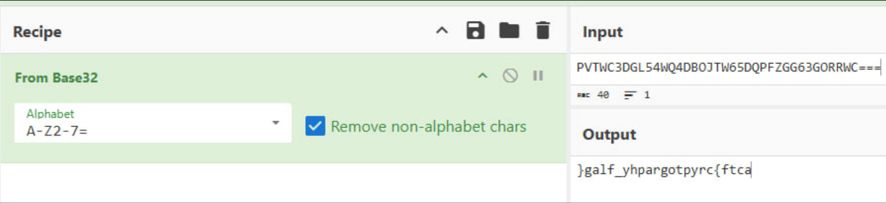
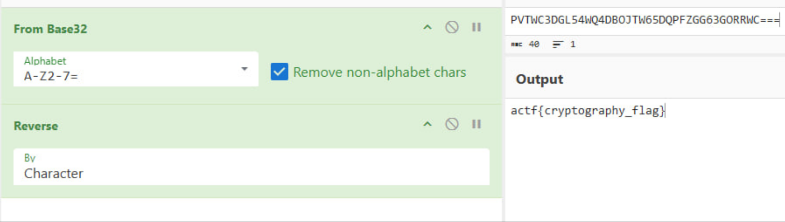

<p align="center">
  
</p>

# 🧩 Дебютний шифр (Debut Cipher)
## **Категорія:** Cryptography  
## **Складність:** Easy

---

### **Опис завдання:**  
Студент першого курсу, надихнувшись лекціями з криптографії, вирішив створити власне зашифроване повідомлення.  
У кожному, навіть найпростішому шифрі, може ховатися щось цікаве...

---
### **Файли**
```debut.txt```
### **Розв'язання:**  
```debut.txt```
```PVTWC3DGL54WQ4DBOJTW65DQPFZGG63GORRWC===```
1. Побачивши рядок, визначаємо, що його структура схожа на ```base32.```

   Виконуємо декодування (наприклад, за допомогою [CyberChef](https://gchq.github.io/CyberChef/))
<p align="center">
  
</p>

2. Отриманий рядок виглядає віддзеркаленим, повернемо йому початковий вигляд.

<p align="center">
  
</p>

---
#### **Flag:** ```actf{cryptography_flag}```  
