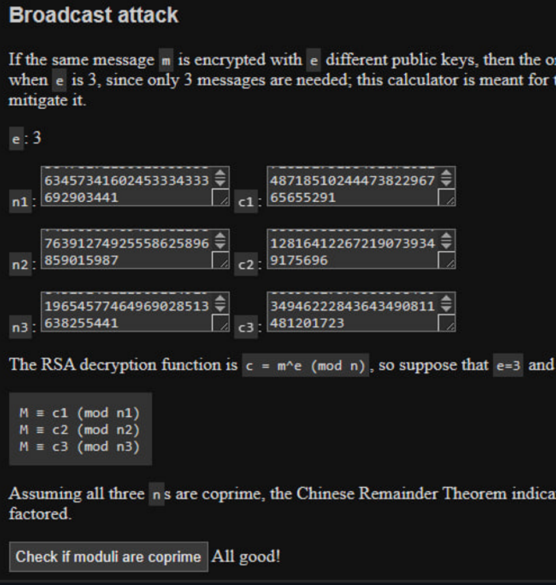
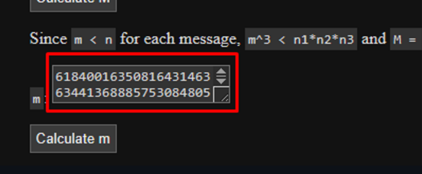
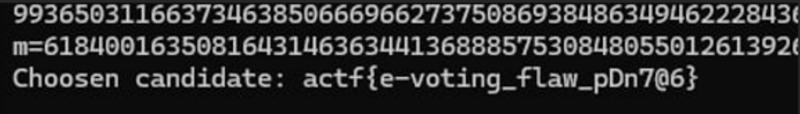

<p align="center">
  
</p>

# 🧩 єГолосування! (eVoting!)
## **Категорія:** Cryptography  
## **Складність:** Hard

---

### **Опис завдання:**  
В університеті створили систему для електронного голосування.  
Для забезпечення прозорості та довіри, кожен голос шифрується одразу для чотирьох членів журі, у кожного з яких є власний постійний публічний ключ.  
Всі публічні ключі відкрито публікуються, аби будь-хто міг переконатися в правильності обробки голосів.  
У тестовому режимі система використала флаг як повідомлення.

---
### **Файли**
```
e-vote.zip
├── e-vote.py
├── Бюлетень 1.vote
├── Бюлетень 2.vote
├── Бюлетень 3.vote
└── Бюлетень 4.vote
```
### **Розв'язання:**  
**Розв'язання:**

1. Проаналізуємо код програми:

    ```python
    #e-vote.py
    from Crypto.Util.number import bytes_to_long, long_to_bytes
    public_keys = [
    101540196203343039193237363887298737065527741074753109601420266985015023027559464289486174652201705157594005316897576053024695971502509955631612697314064019878196402624419019295057597912285186714346024774384219885965101915073767080144699620476030452048478052943647817215002893305863457341602453334333692903441,
    168926806431095974108156359951867848313600777357231327514161176715858443178915477990511125524172557170759668267002156781989485693234711683465652691578720626323133760355427968865848263032886779565796591499165912592061954725656004196938225976601361455490470892857429650976945258219876391274925558625896859015987,
    131441791876622652108066990882773699345420438549661918194633578026212036801397331432524916701884390292615642604154195686150663298337969945514457028502746505876639971822596713199894347359602915128461755613102411524779044354433322540733517548147925495312457176328432914811150311491919654577464969028513638255441,
    125086666808980339093873101066093359885547318159021318417451930062985035824855255502125098369664752135985093060033273907787214924385501542748233036479339745684585715218089699441845588406096291395854265339287698999371030275278136803055531512467459409071480305271919058112831542250356581610175467195135057230021,
    ]

    e = 3

    vote = b"Choosen candidate: actf{example_flag}"
    
    m = bytes_to_long(vote)
    
    for i, n in enumerate(public_keys, 1):
        vote_enc = pow(m, e, n)
        with open(f"Бюлетень {i}.vote", 'wb') as file:
            file.write(long_to_bytes(vote_enc))
    ```

2. Ця система схильна до **Broadcast attack** на RSA, оскільки має маленьку експоненту.  
   Напишемо невеликий скрипт, який зчитує шифротексти з файлів та готує дані для розрахунку:

    ```python
    #from Crypto.Util.number import bytes_to_long, long_to_bytes

    print("Ciphertexts:")
    for i in range(1,4):
        with open(f"Бюлетень {i}.vote", "rb") as f:
            print(bytes_to_long(f.read()))
    
    print(long_to_bytes(int(input("m="))).decode())

    ```

3. Для розрахунку оригінального повідомлення скористаємось онлайн-інструментом [RSA Calculator](https://www.tausquared.net/pages/ctf/rsa.html).  
   Вставляємо публічні ключі та шифротексти, після чого по черзі натискаємо кнопки для обчислень:

    <p align="center">
      
    </p>

4. Як бачимо, система дійсно вразлива до атаки. Отримуємо оригінальне повідомлення:

    <p align="center">
      
    </p>

5. Вставляємо отримане значення `m` у скрипт та отримуємо фінальний результат:

    <p align="center">
      
    </p>


---
#### **Flag:** ```actf{e-voting_flaw_pDn7@6}```  
