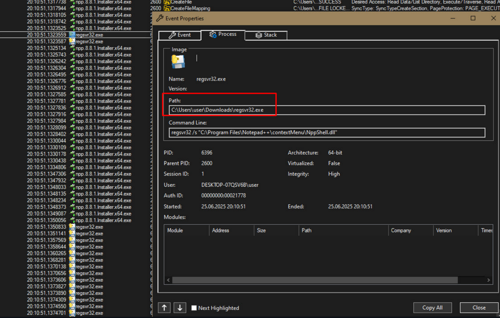
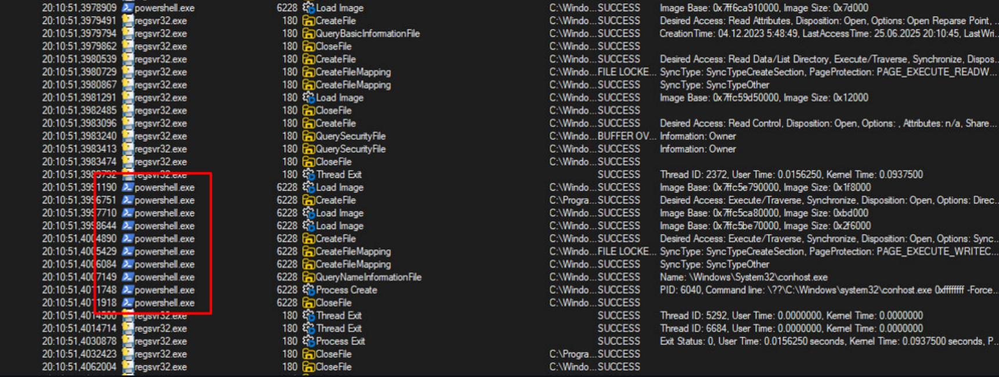
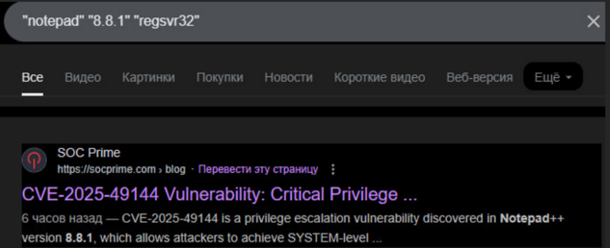
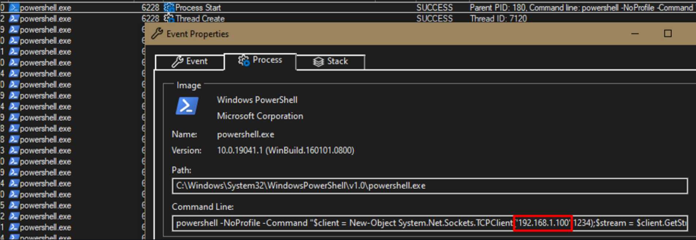

<p align="center">
  
</p>

# 🧩 Блокнот-- (Notepad--)
## **Категорія:** DFIR  
## **Складність:** Easy

---

### **Опис завдання:**  
Одного ранку внутрішня команда з кібербезпеки університету несподівано розіслала терміновий запит до всіх співробітників:  
> “Негайно надішліть останні журнали Procmon за останні 30 хвилин активності”.  

Жодних пояснень не було надано, але пізніше з'ясувалося, що на одному з комп’ютерів зафіксували аномальну активність. Вам передано частину лог-файлу.  

Q1: Розслідуйте, що саме викликало такий поспіх і яку вразливість намагалися виявити фахівці. Відповідь подайте у форматі actf{CVE-****-*****}

Q2: Після запуску процесів з системи встановлюється зовнішнє з'єднання. Визначте IP-адресу, з якою воно встановлюється. Відповідь подайте у форматі actf{ip}.

---
### **Файли**
```Logfile.PML```
### **Розв'язання:**
1. Проаналізуємо наданий лог-файл.  
   У ньому можна знайти три основні процеси:

   - **Інсталятор notepad**
   - **rehsvr32** — скоріш за все нелегітимний, оскільки запускається не із стандартної директорії та має ярлик pyinstaller’у.
   - **powershell**

   <p align="center">
     
   </p>

   <p align="center">
      
   </p>

2. Оскільки ми шукаємо CVE, проведемо невеликий **research** пов’язаний із:

   - **Notepad**
   - Його версією
   - Нелегітимним **regsvr32**

   <p align="center">
      
   </p>

---
#### **Flag:** ```actf{CVE-2025-49144}```  
---

3. Маємо процес **powershell**. Перевіримо, яка саме команда виконується:

   <p align="center">
      
   </p>

---
#### **Flag:** ```actf{192.168.1.100}```  
