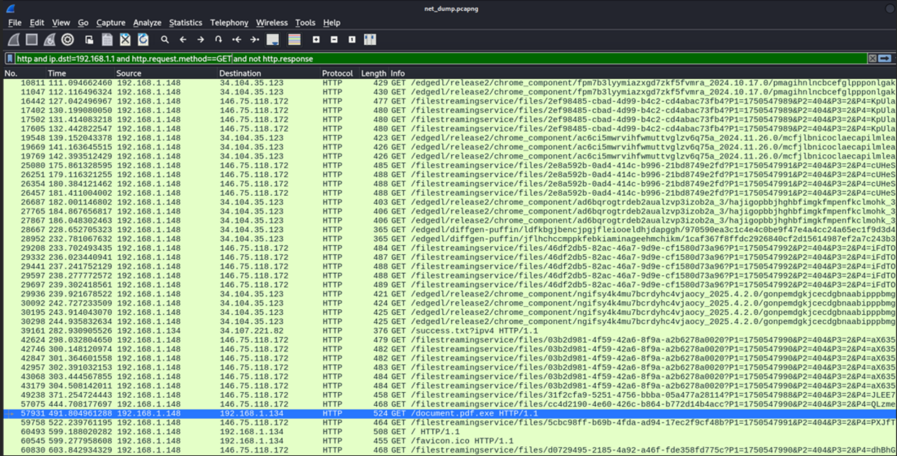
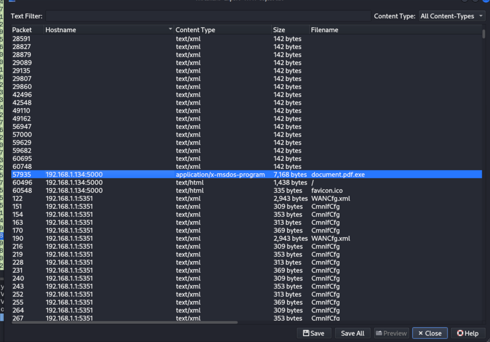
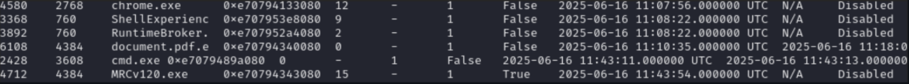
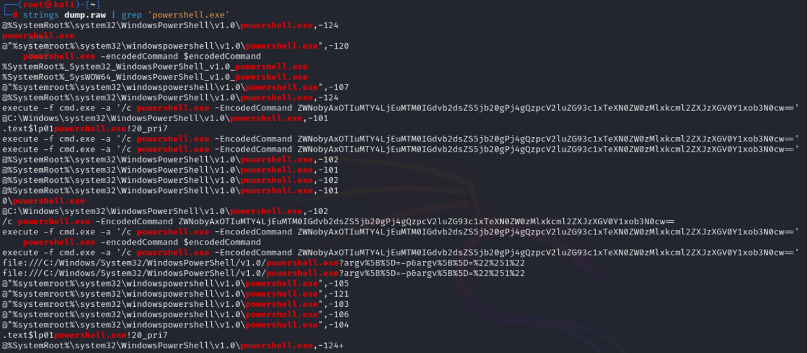
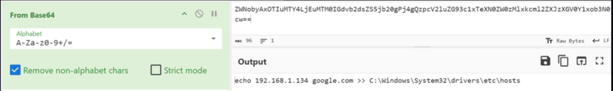
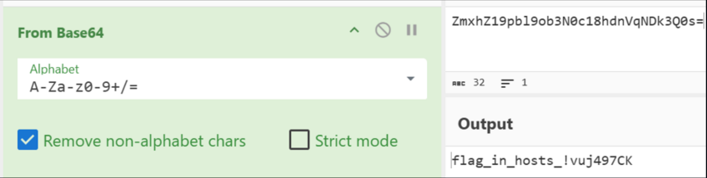
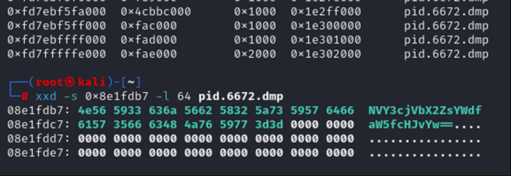
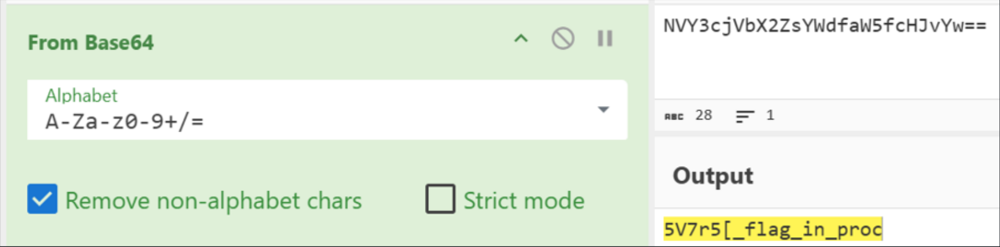

<p align="center">
  
</p>

# 🧩 Згода на компрометацію (Signed to Be Owned)
## **Категорія:** DFIR  
## **Складність:** Medium

---

### **Опис завдання:**  
У внутрішньому чаті студентського парламенту з’явилося посилання на нібито офіційний документ, який потрібно було терміново підписати. Один зі студентів відкрив файл, після чого частина студентів почала скаржитися на підозрілі входи до їх Google-акаунтів.  
Проведіть розслідування, з’ясуйте, що сталося, і знайдіть доказ того, як відбулася атака.  

Q1: Проаналізуйте дамп мережевого трафіку та визначте IP-адресу, з якої було завантажено шкідливий файл. Відповідь подайте у форматі actf{IP}.  

Q2: Проаналізуйте дамп оперативної пам’яті машини та визначте PID процесу, який відповідає за відкриття шкідливого файлу. Відповідь подайте у форматі actf{PID}.  

Q3: У наданому дампі пам’яті також виявлено виконання шкідливої PowerShell-команди. Знайдіть цю команду та дослідіть те, що вона змінила. Відповідь подайте у форматі actf{flag}.  

Bonus Q: Ходять чутки, що один із учасників студентського парламенту знав більше, ніж казав. Можливо, намагався приховати щось важливе… На його столі знайшли записку з цікавим написом: “notepad.exe → 0x8e1fdb7”. Відповідь подайте у форматі actf{flag}.

---
### **Файли**
```dump.raw```  

```net_dump.pcapng```

[link to files](https://drive.google.com/drive/folders/1Mjsq9Px0EPYBMbkKLKWBhdsl3rLFkNvJ?usp=sharing)

### **Розв'язання:**  
1. IP знаходиться шляхом фільтрування потрібних пакетів або через експорт об’єктів.
   <p align="center">
    
   </p>

   <p align="center">
    
  </p>
  
---
#### **Flag:** ```actf{192.168.1.134}```
---
  
2. За допомогою **Volatility3** знаходимо процес **document.pdf.exe** та його PID.  
   ```vol -f dump.raw windows.pslist```
   <p align="center">
     
   </p>

---
#### **Flag:** ```actf{6108}```
---

3. Знаходимо в рядках дампу запуск powershell.
  ```strings dump.raw | grep 'powershell.exe'```
  <p align="center">
    
  </p>
  
4. Виконаємо декодування команди.  
  <p align="center">
    
  </p>

5. Бачимо що був змінений файл **hosts**, зробимо його дамп.  
   ```vol -f dump.raw windows.filescan | grep hosts```
   
   ```vol -f dump.raw windows.dumpfiles.DumpFiles --virtaddr 0xe707966b7180```
   
   ```cat file.0xe707966b7180.0xe70794e0a070.DataSectionObject.hosts.dat```
   <p align="center">
      
   </p>

6. Декодуємо рядок та отримуємо флаг.
   <p align="center">
     
   </p>

---
#### **Flag:** ```actf{flag_in_hosts_!vuj497CK}```
---
  
7. Для бонусного флагу спочатку потрібно зробити дамп пам’яті процесу **notepad.exe**, потім прочитати що знаходиться на зміщенні ```0x8e1fdb7```.  
  ```vol -f dump.raw windows.pslist (pid of notepad.exe - 6672)```  
  ```vol -f dump.raw windows.memmap.MemMap --pid 6672 --dump```  
  ```xxd -s 0x8e1fdb7 -l 64 pid.6672.dmp``` 
   <p align="center">
    
   </p>  
   Після декодування отримаємо флаг.  
   <p align="center">
     
   </p>

---
#### **Flag:** ```actf{5V7r5[_flag_in_proc}```
---
