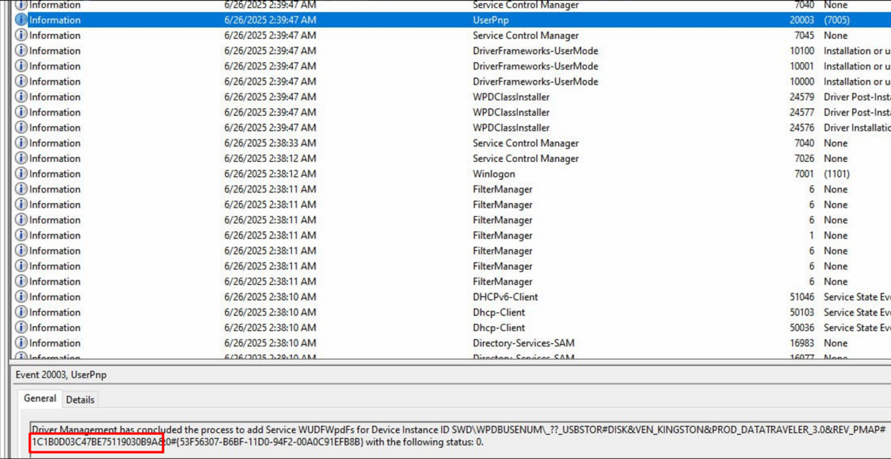

<p align="center">
  
</p>

# 🧩 USB: Unusual Secret Breach
## **Категорія:** DFIR  
## **Складність:** Easy

---

### **Опис завдання:**  
Під час внутрішнього аудиту безпеки стало відомо про зникнення кількох конфіденційних документів. Є підозра, що їх могли вивести за межі системи через USB-носій.  
Служба безпеки надала журнал подій із одного з підозрюваних комп’ютерів. Ваше завдання – з’ясувати, який саме пристрій було підключено.  
Q: Визначте серійний номер підключеного USB-пристрою. Відповідь подайте у форматі actf{serial_number}.

---
### **Файли**
```system_log.evtx```
### **Розв'язання:**  
1. Знайдемо івент пов’язаний із UserPnp та дістанемо серійний номер флешки.
   <p align="center">
     
   </p>
---
#### **Flag:** ```actf{1C1B0D03C47BE75119030B9A}```
