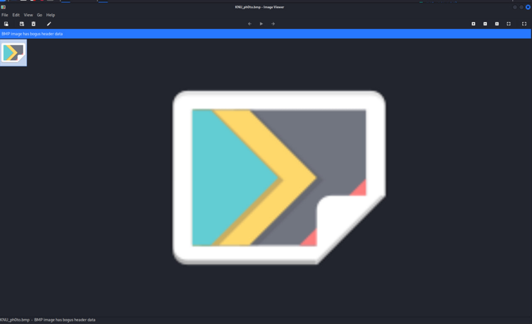
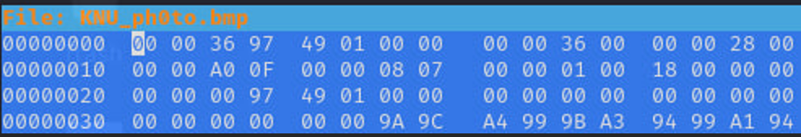
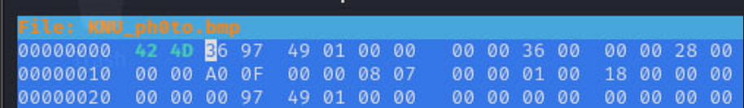
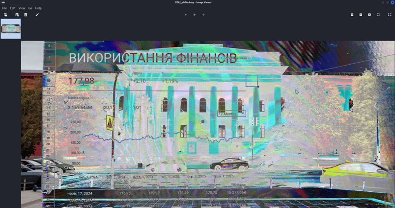
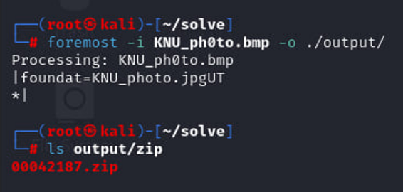
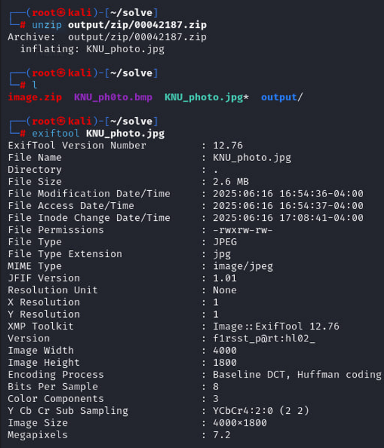
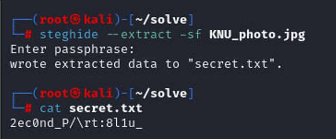
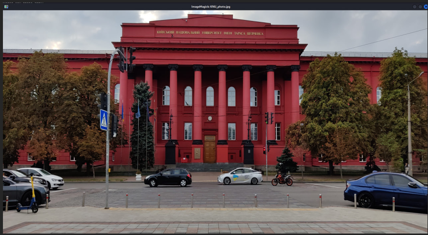
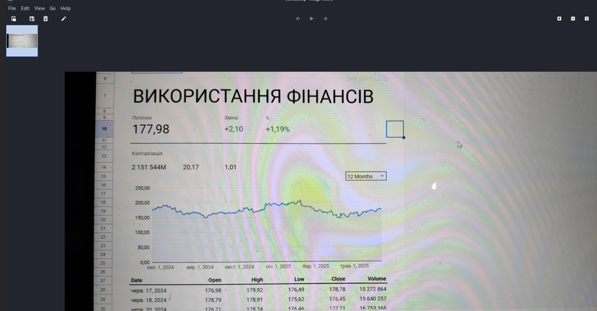
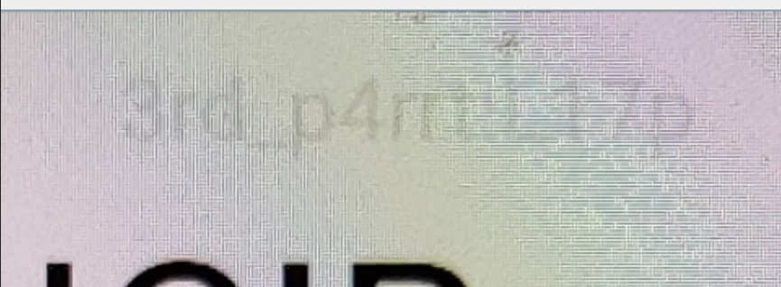

<p align="center">
  
</p>

# 🧩 Ціна зображення (Cost of the Image)
## **Категорія:** Forensics  
## **Складність:** Medium  

---

### **Опис завдання:**  
Нещодавно в університеті стався витік інформації, але його походження залишалося загадкою. Під час перегляду внутрішніх повідомлень команда розслідувачів помітила дивне зображення, що циркулює між співробітниками.  
Ніхто не знає, що воно приховує – але вам доручено розкрити цей загадковий слід.  

---
### **Файли**
```
image.zip
    └── KNU_ph0to.bmp
```
### **Розв'язання:**  
1. Після завантаження та розпакування архіву отримаємо зображення, яке неможливо відкрити.
  
  <p align="center">
    
  </p>
  
2. Відкриємо його в hexeditor, та побачимо, що перші два байти bmp формату записані нулями.
  
  <p align="center">
    
  </p>
  
3. Виправимо на потрібні байти, та відкриємо зображення.
  
  <p align="center">
    
  </p>
  
  <p align="center">
    
  </p>
  
4. Бачимо спотворене зображення. Ні в метаданих, ні в LSB, ні в strings ми нічого не отримаємо. Спробуємо витягнути сховані файли через foremost:
  
  ```foremost -i KNU_ph0to.bmp -o ./output/```
  
  <p align="center">
    
  </p>
  
5. Отримаємо архів, після розпакування дістанемо ще одне зображення. Якщо подивитись його метадані – отримаємо першу частину флага у графі “Version”.
  
  <p align="center">
    
  </p>
  
  **First flag part:** `hl02_`
  
6. Далі за класичним ходом спробуємо знайти щось в LSB. Отримаємо текстовий файл з другою частиною флага.
   
  <p align="center">
    
  </p>
  
  **Second flag part:** `8l1u_`
  
7. Якщо відкриємо зображення, побачимо – це оригінальне фото університету.
  
  <p align="center">
    
  </p>
  
8. За допомогою stegsolve виконаємо XOR операцію між спотвореним та оригінальним зображенням. Отримаємо наступне:
  
  <p align="center">
    
  </p>
  
9. Якщо уважно продивитись зображення, над останніми буквами надпису “ВИКОРИСТАННЯ ФІНАНСІВ” побачимо останню, третю частину флагу.
  
  <p align="center">
    
  </p>

---
#### **Flag:** ```actf{hl02_8l1u_L17p}```
---
