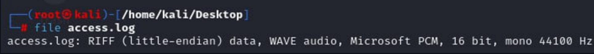
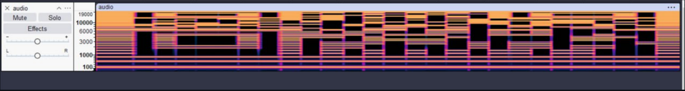
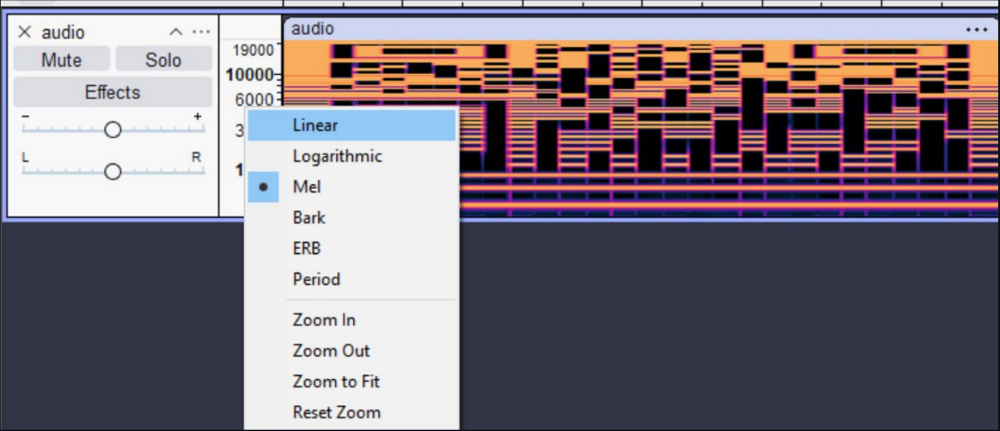
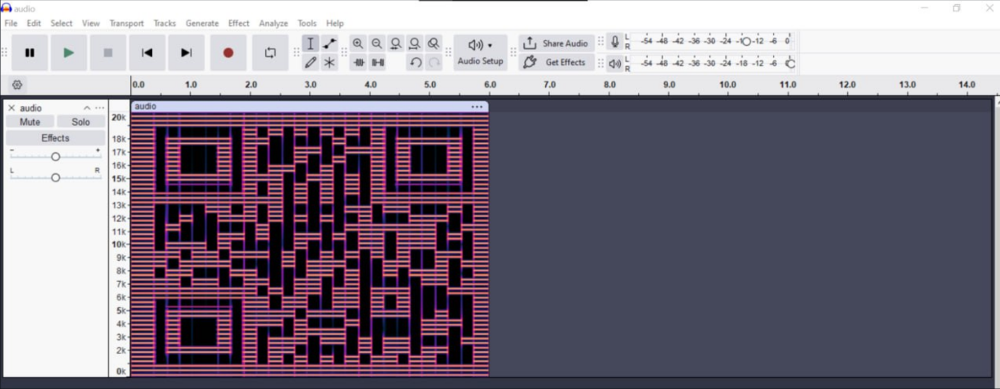
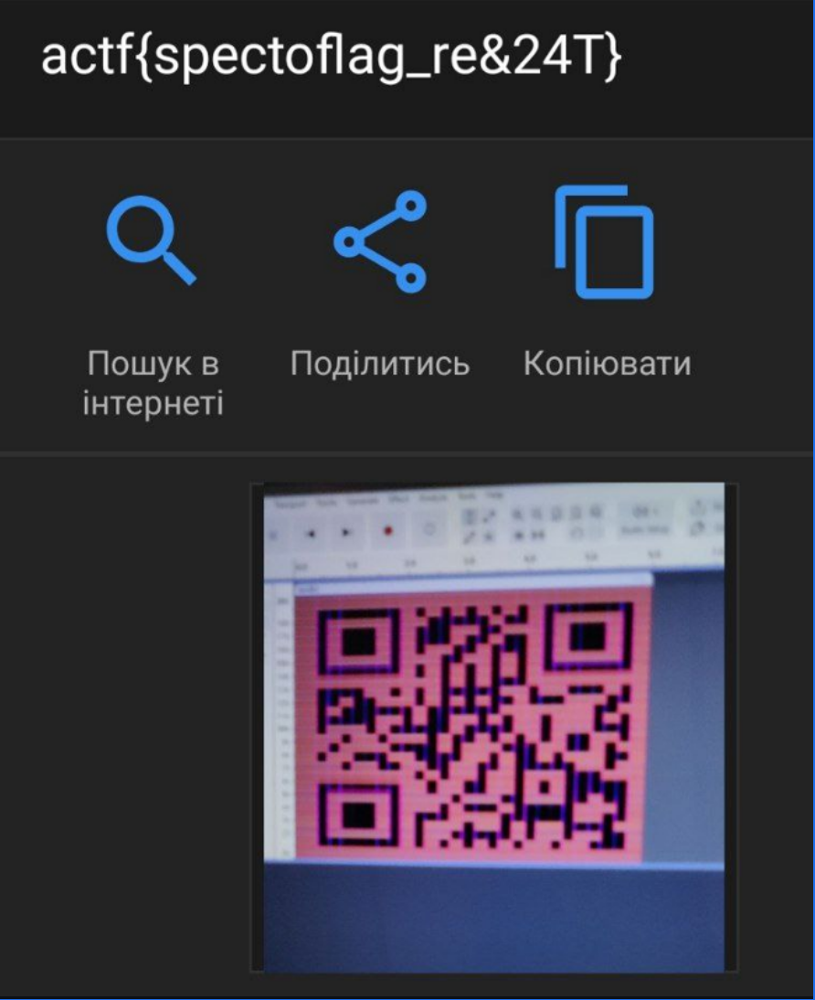

<p align="center">
  
</p>

# 🧩 Шум у логах (Noise in the Logs)
## **Категорія:** Forensics  
## **Складність:** Easy  

---

### **Опис завдання:**  
Після технічних робіт у серверній університету декілька систем вийшли з ладу.  
Один зі співробітників повідомив, що на нього чинили тиск, аби “_не чіпати лог-файли_” та “_не ставити зайвих питань_”. Ви вирішили розібратися в цій ситуації самостійно – і отримали доступ до логів.  
Те, що ви там знайшли, виявилося не таким простим, як здавалося на перший погляд.  

---
### **Файли**
```access.log```
### **Розв'язання:**  
1. Після завантаження файлу, з нього не вийде отримати інформацію ні через `cat`, ні через `strings`. Потрібно перевірити, чи це дійсно текстовий файл.
  
  <p align="center">
    
  </p>
  
2. Бачимо, що це насправді **wav-файл**. Після відкриття почуємо різні сигнали. Спробуємо переглянути спектрограму, наприклад, у **Audacity**.
  
  <p align="center">
    
  </p>
  
3. Бачимо щось схоже на **QR-код**. Оберемо **лінійне відображення частот** та налаштуємо масштаб.
  
  <p align="center">
    
  </p>
  
  <p align="center">
    
  </p>
  
4. Після сканування отримаємо флаг.
  
  <p align="center">
    
  </p>
  
---
#### **Flag:** ```actf{spectoflag_re&24T}```
