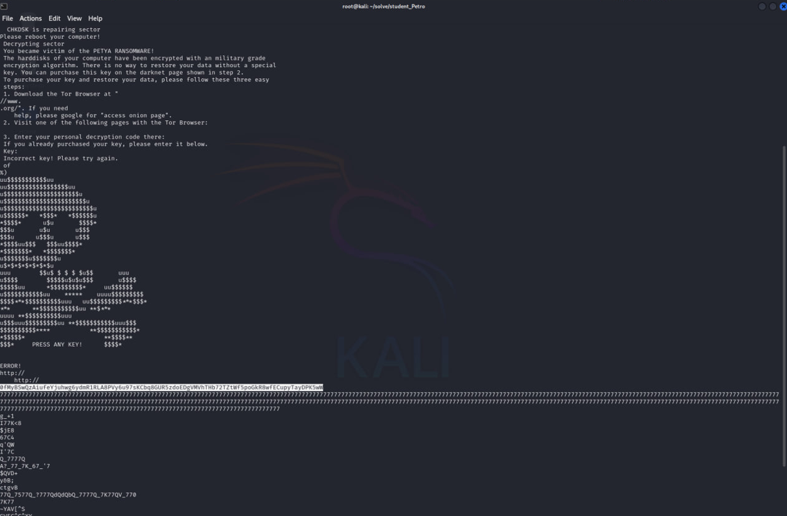
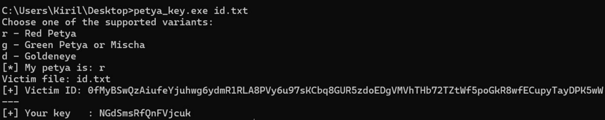

<p align="center">
  
</p>

# 🧩 Студент Петро (Student Petro)
## **Категорія:** Forensics  
## **Складність:** Medium  

---

### **Опис завдання:**  
До студентського парламенту звернувся студент Петро. За його словами, після завантаження «якогось корисного софту з інтернету» комп'ютер перезавантажився, а замість звичної системи з'явився дивний екран із вимогою викупу.  
Петро приніс невеличкий дамп диску і попросив допомоги: «Мені просто треба хоч якось повернути доступ до файлів… хоча б диплом».  
Q: Проаналізуйте надану частину диску. Визначте ключ, який потрібен для дешифрування, та подайте його у вигляді actf{key}.

---
### **Файли**
```disk.img```
### **Розв'язання:**  
1. Оскільки це невелика частина диску, ні `volatility`, ні `autopsy` нічого не дістануть. Скористаємося `strings`.
  
  <p align="center">
    
  </p>
  
2. Тут ми можемо побачити, що за шифруванням диску стоїть програма-вимагач **Petya**. Проаналізувавши строки, знайдемо **personal id** постраждалого.
  Зробимо невеликий research в інтернеті та знайдемо [софт](https://github.com/hasherezade/petya_key), який генерує ключі дешифрування за знайденим **id**.
  Скористаємося ним і отримаємо ключ.

  <p align="center">
    
  </p>
  
#### **Flag:** ```actf{NGdSmsRfQnFVjcuk}```
