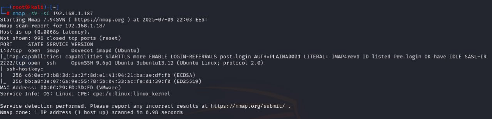
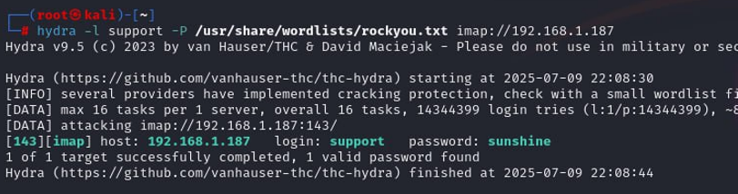
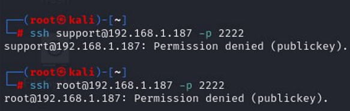
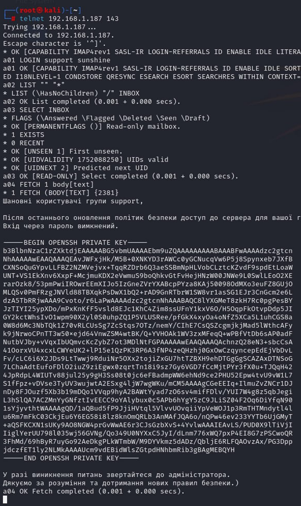
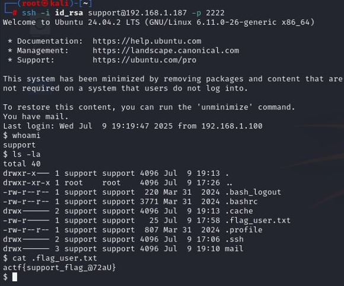
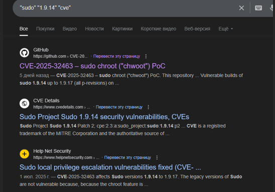

<p align="center">
  
</p>

# 🧩 Компроментаційна підтримка (Compromising Support)
## **Категорія:** Offensive Security  
## **Складність:** Medium  

---

### **Опис завдання:**  
Студентський парламент розгорнув власний поштовий сервер для організації зворотного зв’язку зі студентами.  
Пошта `support@knu.actf.ua` – ключова ланка у спілкуванні.  
Ваше завдання – провести пентест цього сервера, виявити слабкі місця та показати, наскільки надійним є цей сервіс.  
Q1: Отримайте user flag. Відповідь подайте у форматі actf{flag}.  
Q2: Отримайте root flag. Відповідь подайте у форматі actf{flag}.  
PS: До завдання відносяться лише порти 2222 та 143

---
### **Розв'язання:**  
1. Проскануємо порти, та виявимо наявні на них сервіси.  
  <p align="center">  
      
  </p>  
  
2. Маємо **Dovecot IMAP** та **ssh**. Перше що спадає на думку — виконати **bruteforce** поштового сервісу.  Оскільки маємо пошту `support@knu.actf.ua`, зробимо припущення що логіном буде `support`. Використаємо утиліту **hydra**:  
  ```  
  hydra -l support -P /usr/share/wordlists/rockyou.txt imap://address  
  ```  
  <p align="center">  
      
  </p>  
  
3. Спробуємо виконати **ssh** з’єднання із цим паролем.  
  <p align="center">  
      
  </p>  
  
4. Як можна побачити, ні `support`, ні `root` не приймає з’єднання. Тоді перевіримо що є в пошті.  
  <p align="center">  
      
  </p>  
  
5. Бачимо лист із приватним ключем ssh. Виконаємо з’єднання використовуючи його.  
Після перевірки вмісту домашньої директорії отримуємо перший флаг.  
  <p align="center">  
      
  </p>  
  
---
#### Flag: `actf{support_flag_@72aU}`  
---
  
6. Користувач `support` не може отримати доступ до sudo та до списку команд, які йому доступні. Також на хості немає додаткових векторів ескалації привелегій. Перевіримо версію **sudo** та виконаємо research.  
```   
$ sudo --version  
Sudo version 1.9.14  
Sudoers policy plugin version 1.9.14  
Sudoers file grammar version 50  
Sudoers I/O plugin version 1.9.14  
Sudoers audit plugin version 1.9.14  
```
  <p align="center">  
      
  </p>  
  
7. Використаємо скрипт наданий у github [репозиторії](https://github.com/pr0v3rbs/CVE-2025-32463_chwoot). Запишемо його у файл, надамо йому можливість виконання, та запустимо.  
   Після отримання root, в директорії `/root/` можна знайти флаг.  
  <p align="center">  
      
  </p>  

---
#### Flag: ```actf{chwoot_flag_3p~6J}```  
---
