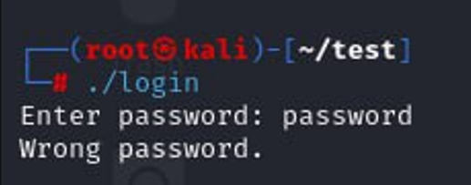
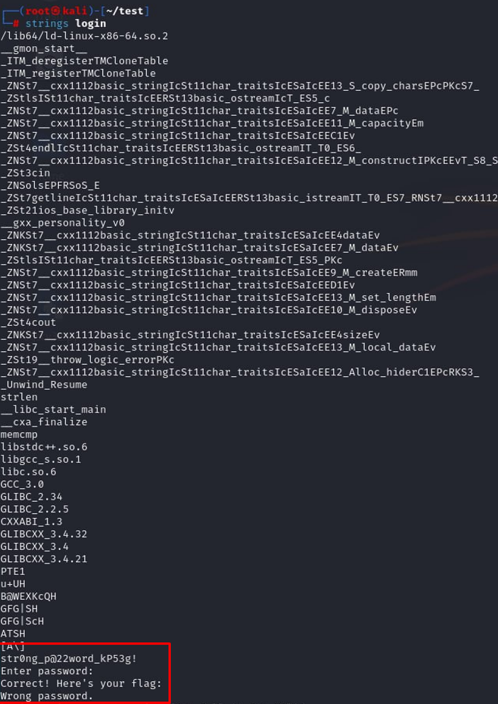
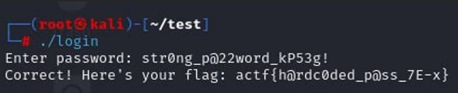

<p align="center">
  
</p>

# 🧩 Алогомора не підійшла... (Alohomora Didn't Work...)
## **Категорія:** Reverse Engineering  
## **Складність:** Easy  

---

### **Опис завдання:**  
В архівах факультету знайшли стару утиліту, що колись використовувалася для доступу до навчальних матеріалів.
Проблема в тому, що пароль від неї забуто. Вам потрібно відновити пароль і подивитися, що ховається всередині.   

---
### **Файли**
```login```
### **Розв'язання:**  
1. Нам надано ELF файл, який при запуску запитує пароль.
   
  <p align="center">
    
  </p>
  
2. Перевіримо `strings` файлу:
  
  <p align="center">
    
  </p>
  
3. Можемо побачити рядки, пов’язані із введенням паролю та реакцією програми. Також є рядок, схожий на пароль — спробуємо його використати.
  
  <p align="center">
    
  </p>

---
#### **Flag:** ```actf{h@rdc0ded_p@ss_7E-x}```
---
