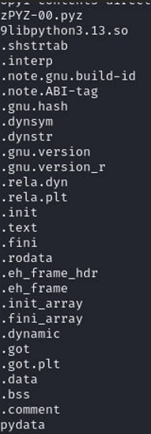
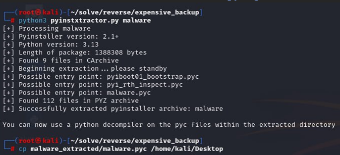
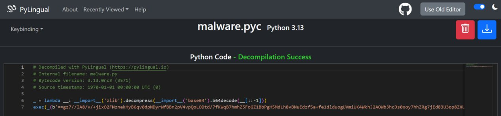
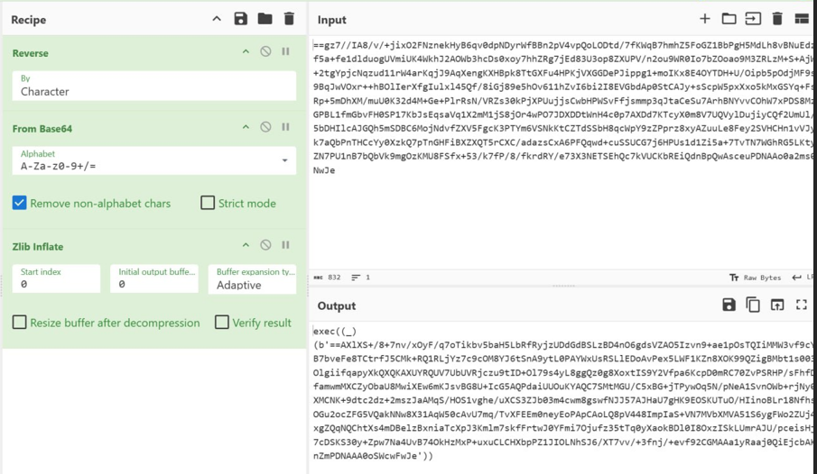
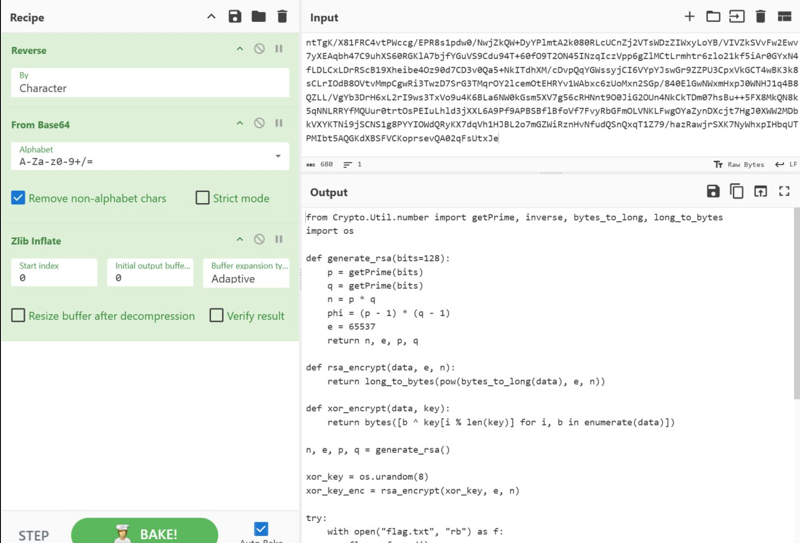
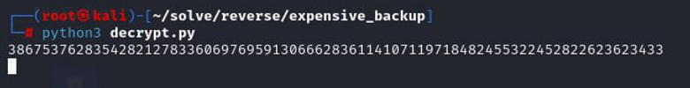
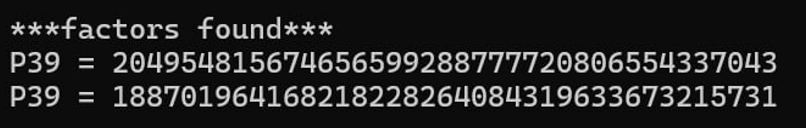
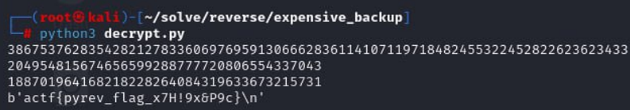

<p align="center">
  
</p>

# 🧩 Коштовний бекап (Expensive Backup)
## **Категорія:** Reverse Engineering  
## **Складність:** Hard  

---

### **Опис завдання:**  
Після того як один із системних адміністраторів взяв тривалу відпустку, його колеги виявили підозрілий процес, який повинен був регулярно створювати резервні копії файлів користувачів — але замість архівів на диску з’являлися зашифровані .enc-файли та повідомлення з вимогами викупу.  
Файл, який відповідає за шифрування, та один із зашифрованих файлів змогли витягнути з серверу.  
З’ясуйте, як саме працює програма, та поверніть доступ до зашифрованих даних.

---
### **Файли**
```
Expensive_Backup.zip
├── flag.enc
├── README.txt
├── zip_password.txt
└── malware.zip
    └── malware
```
### **Розв'язання:**  
1. Спочатку прочитаємо `README.txt`:
  
  ```
	Your file was encrypted!
	Send 1 BTC to this wallet: [Deleted]
	In comment write your ID_1 and ID_2
	ID1 = 55817cbbe921f8016f19d1201533f8cf4628548ba169d5be81abde640f499909
	ID2 = 2edb8f847d627e2d899893bc83ac1b5164943e79ba74dd8e4386146d2e4ed984
  ```
  
2. Бачимо досить типічне повідомлення із вимогами викупу.  
	Перейдемо до аналізу бінарного файлу, перевіримо `strings`.
  
	<p align="center">
		
	</p>
  
3. У рядках файлу бачимо ознаки того, що виконуваний файл був написаний на **Python 3.13**.  
	Використаємо **pyinstxtractor**, щоб витягнути `.pyc` файл, а потім декомпілюємо його за допомогою [pylingual.io](https://pylingual.io).

	<p align="center">
		
	</p>

	<p align="center">
		
	</p>
  
4. Після декомпіляції бачимо, що код обфускований.  
	Проаналізувавши, як виконується обфускація, складаємо обернений ланцюг дій:

	- реверс рядка  
	- base64 декодування  
	- zlib розпакування
  
5. Виконаємо ці дії в [CyberChef](https://gchq.github.io/CyberChef/).

	<p align="center">
		
	</p>
  
6. Бачимо, що є ще один шар обфускації.  
	Повторюємо ті ж самі дії, поки не отримаємо код.

	<p align="center">
		
	</p>
  
7. Після кількох ітерацій отримаємо фінальний код для аналізу.

  ```python
  from Crypto.Util.number import getPrime, inverse, bytes_to_long, long_to_bytes
  import os
  
  def generate_rsa(bits=128):
      p = getPrime(bits)
      q = getPrime(bits)
      n = p * q
      phi = (p - 1) * (q - 1)
      e = 65537
      return n, e, p, q
  
  def rsa_encrypt(data, e, n):
      return long_to_bytes(pow(bytes_to_long(data), e, n))
  
  def xor_encrypt(data, key):
      return bytes([b ^ key[i % len(key)] for i, b in enumerate(data)])
  
  n, e, p, q = generate_rsa()
  
  xor_key = os.urandom(8)
  xor_key_enc = rsa_encrypt(xor_key, e, n)
  
  try:
      with open("flag.txt", "rb") as f:
          flag = f.read()
  except FileNotFoundError:
      print("flag.txt NOT FOUND")
      exit(1)
  
  encrypted_flag = xor_encrypt(flag, xor_key)
  
  with open("flag.enc", "wb") as f:
      f.write(encrypted_flag)
  
  os.remove("flag.txt")
  
  with open("README.txt", "w") as f:
      f.write(f"""Your file was encrypted!
  Send 1 BTC to this wallet: [Deleted]
  In comment write your ID_1 and ID_2
  ID1 = {long_to_bytes(n).hex()}
  ID2 = {xor_key_enc.hex()}
  """)
  ```
  Спочатку генерується випадковий **XOR-ключ** довжиною 8 байт.  
  Цей ключ використовується для шифрування основного файлу (у даному випадку — **flag.txt**) за допомогою операції **побітового XOR**.

  Щоб захистити XOR-ключ, його також шифрують за допомогою алгоритму **RSA**.  
  Для цього генеруються два випадкових простих числа по 128 біт, які перемножуються, щоб отримати модуль `n = p × q`.  
  Відкритий показник `e` встановлено стандартним значенням **65537**.  
  Після цього XOR-ключ шифрується RSA та зберігається у файлі **README.txt**.
  
  Далі файл **flag.txt** шифрується за допомогою XOR-ключа, зашифрована версія зберігається як **flag.enc**, а оригінальний файл видаляється.
  
  У результаті у файлі **README.txt** залишаються два значення:
  
  - **ID1** — це модуль `n` у шістнадцятковому форматі (потрібен для розв’язання RSA)
  - **ID2** — XOR-ключ, зашифрований RSA (шифротекст)

  Слабкість коду знаходиться у генерації публічного ключа.  
	Для його створення використовуються недостатньо великі прості числа, тому ми можемо факторизувати публічний ключ, знайти `p` та `q` і створити приватний ключ `d`.
  
8. Мій варіант коду для дешифрування:
  ```python
  from Crypto.Util.number import inverse, bytes_to_long, long_to_bytes

  rsa_pub = int("55817cbbe921f8016f19d1201533f8cf4628548ba169d5be81abde640f499909", 16)
  xor_enc = int("2edb8f847d627e2d899893bc83ac1b5164943e79ba74dd8e4386146d2e4ed984", 16)
  
  print(rsa_pub)
  
  p = int(input())
  q = int(input())
  phi = (p - 1) * (q - 1)
  e = 65537
  d = inverse(e, phi)
  
  xor_key = long_to_bytes(pow(xor_enc, d, rsa_pub))
  with open('flag.enc', 'rb') as f:
    flag_enc = f.read()
  
  flag = bytes([b ^ xor_key[i % len(xor_key)] for i, b in enumerate(flag_enc)])
  print(flag)
  ```
  <p align="center">
	
  </p>
  	
   З файлу `README.txt` я захардкодив `rsa_pub` (ID1) та `xor_enc` (ID2). Скрипт виведе `rsa_pub` у вигляді числа. Далі скористаємося [yafu]https://github.com/bbuhrow/yafu) для факторизації: `yafu-x64.exe factor(число)`
  <p align="center">
	
</p>
  
9. Після введення факторів у скрипт отримаємо розшифрований флаг.

	<p align="center">
		
	</p>

---
#### **Flag:** ```actf{pyrev_flag_x7H!9x&P9c}```
---
