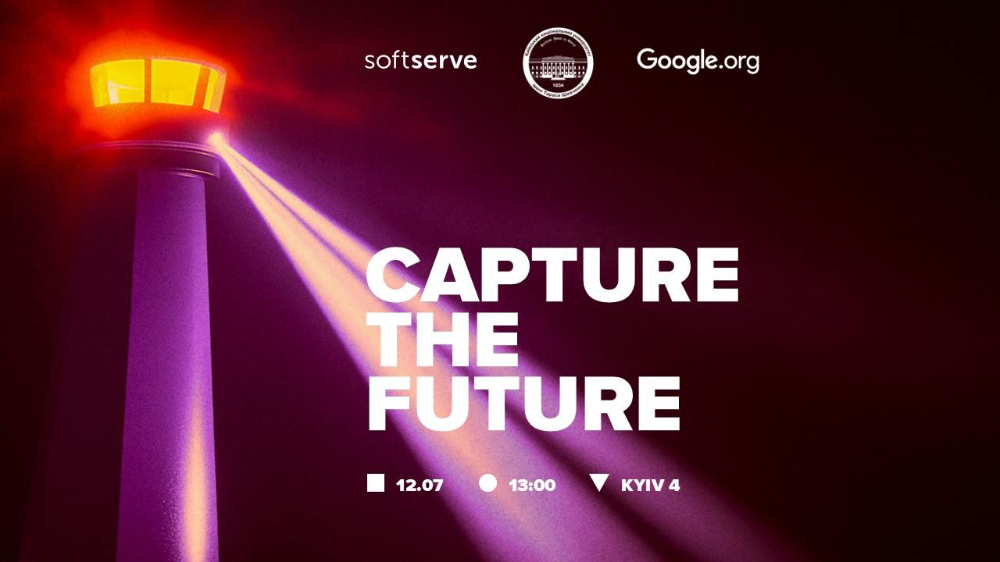

# 🛡️ Advanced Cybersecurity CTF — KNU x Google x SoftServe

Цей репозиторій містить **write-up** та **файли завдань** з **Advanced Cybersecurity CTF**, який відбувся **12 липня 2025 року** у **Києві, Україна**.

---

## 📍 Про захід

Цей CTF був частиною курсу **"Кібербезпека для малих організацій"**, ініційованого **Google.org** та організованого у партнерстві з:

- 🎓 **Київський національний університет імені Тараса Шевченка (КНУ)** — організатор курсу та координатор CTF  
- 🌍 **Google.org** — ініціатор курсу “Кібербезпека для малих організацій” 
- 🏢 **SoftServe** — tech-партнер, який надав локацію та підтримку
- 💼 **BDO Україна** — допомогли студентам отримати контакти реальних малих бізнесів для практики
- 🧠 **Hackathon Expert** — підтримував на всіх етапах підготовки й розвитку сценаріїв

---

## 🧩 Формат

- ⏱️ **3 години** практичних завдань з кібербезпеки  
- 🔐 **Реалістичні сценарії атак та захисту**
- 👥 **Команди до 5 учасників**
- 🎁 **Призи**, нетворкінг, перекуси та чудова атмосфера

---

## 📁 Challenges

| Категорія           | Назва                      | Складність| Опис                          |
|---------------------|----------------------------|-----------|-------------------------------|
| Cryptography        | [Дебютний шифр](<Challenges/Cryptography/The debut cipher [Easy]/README.md>)              |Easy       |Студент першого курсу, надихнувшись лекціями з криптографії, вирішив створити власне зашифроване повідомлення...|
| Cryptography        | [Ключ під килимком](<Challenges/Cryptography/Key Under the Doormat [Easy]>)          |Easy       |Під час внутрішнього аудиту було виявлено підозрілу активність на комп’ютері одного з викладачів...|
| Cryptography        | [Зашифрований конспект](<Challenges/Cryptography/The Encrypted Notes [Easy]>)      |Easy       |Під час підготовки до сесії викладач зашифрував свій унікальний конспект, щоб ніхто не міг ним скористатися без дозволу...|
| Cryptography        | [Назад у минуле](<Challenges/Cryptography/Back to the Past [Medium]>)             |Medium     |Під час розслідування несанкціонованого доступу до внутрішніх даних університету була знайдена частина коду для шифрування важливої інформації...|
| Cryptography        | [єГолосування!](<Challenges/Cryptography/eVoting! [Hard]>)              |Hard       |В університеті створили систему для електронного голосування...|
| DFIR                | [USB: Unusual Secret Breach](<Challenges/DFIR/USB Unusual Secret Breach [Easy]>) |Easy       |Під час внутрішнього аудиту безпеки стало відомо про зникнення кількох конфіденційних документів...|
| DFIR                | [Блокнот--](<Challenges/DFIR/Notepad-- [Easy]>)                  |Easy       |Одного ранку внутрішня команда з кібербезпеки університету несподівано розіслала терміновий запит до всіх співробітників...|
| DFIR                | [Згода на компрометацію](<Challenges/DFIR/Signed to Be Owned [Medium]>)     |Medium     |У внутрішньому чаті студентського парламенту з’явилося посилання на нібито офіційний документ, який потрібно було терміново підписати...|
| DFIR                | [Кіт у мішку](<Challenges/DFIR/Cat in the Bag [Hard]>)                |Hard       |Одного ранку всі комп’ютери університету одночасно отримали пакет із “терміновим оновленням системи”...|
| Forensics           | [Шум у логах](<Challenges/Forensics/Noise in the logs [Easy]>)                |Easy       |Після технічних робіт у серверній університету декілька систем вийшли з ладу...|
| Forensics           | [Ціна зображення](<Challenges/Forensics/Cost of the Image [Medium]>)            |Medium     |Недавно в університеті стався витік інформації, але його походження залишалося загадкою...|
| Forensics           | [Студент Петро](<Challenges/Forensics/Student Petro [Medium]>)              |Medium     |До студентського парламенту звернувся студент Петро. За його словами, після завантаження «якогось корисного софту з інтернету» комп'ютер перезавантажився...|
| Reverse Engineering | [Алогомора не підійшла...](<Challenges/Reverse Engineering/Alohomora Didn't Work [Easy]>)   |Easy       |В архівах факультету знайшли стару утиліту, що колись використовувалася для доступу до навчальних матеріалів...|
| Reverse Engineering | [Коштовний бекап](<Challenges/Reverse Engineering/Expensive Backup [Hard]>)            |Hard       |Після того як один із системних адміністраторів взяв тривалу відпустку, його колеги виявили підозрілий процес, який повинен був регулярно створювати резервні копії файлів користувачів...|
| Offensive Security  | [КНУшний ніж](<Challenges/Offensive Security/KNU Knife [Medium]>)                |Medium       |Універсальний інструмент, створений групою ініціативних студентів, отримав назву «КНУшний ніж»...|
| Offensive Security  | [Компроментаційна підтримка](<Challenges/Offensive Security/Compromising Support [Medium]>) |Medium     |Студентський парламент розгорнув власний поштовий сервер для організації зворотного зв’язку зі студентами...|
| Offensive Security  | [NewTriton](<Challenges/Offensive Security/NewTriton [Medium]>)                  |Medium     |Університет розробляє нову освітню платформу — NewTriton...|

---

## 📎 License

This project is licensed under the  
**Creative Commons Attribution-NonCommercial-ShareAlike 4.0 International License**.

🔗 [View license](https://creativecommons.org/licenses/by-nc-sa/4.0/)

> You may share and adapt the material, but **commercial use is prohibited**, and **you must give appropriate credit** and share under the same license.

---

Feel free to contribute or use this task for educational CTFs with attribution!
